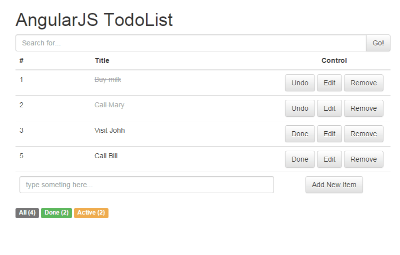

#AngularJS - TodoList
話說兩年前小小摸過[EmberJS](http://emberjs.com)、一年前用[React](https://facebook.github.io/react)寫過幾個plugin後，就沒再摸其他的Framework，甚至連AngulrJS這麼火紅的東西都沒好好認真玩過。先來寫個TodoList複習一下吧。

##功能
- 搜尋
- 新增
- 修改
- 刪除
- 改變狀態：做完 / 未做完
- 計數

##說明
###搜尋
在搜尋列中，我們利用 `ng-model="searchInput"` 綁定 `<input>`，然後將每個會被重複的todo item區塊標註filter而能依照searchInput的值做篩選。

####搜尋input
利用 `ng-model="searchInput"` 綁定 `<input>`。

	<input type="text" placeholder="Search for..." ng-model="searchInput">

####todo item區塊
`filter: searchInput` 表示依照searchInput的值做篩選。

	<tr ng-repeat="x in todos | filter: searchInput">
		...
	</tr>

###新增

###修改
###刪除
###改變狀態：做完 / 未做完
###計數

##Demo
來看一下完成品吧！  

